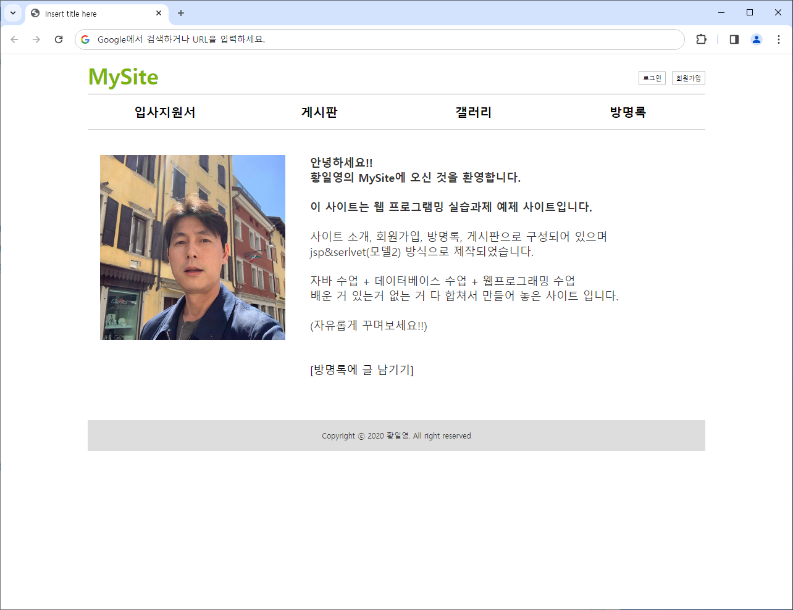
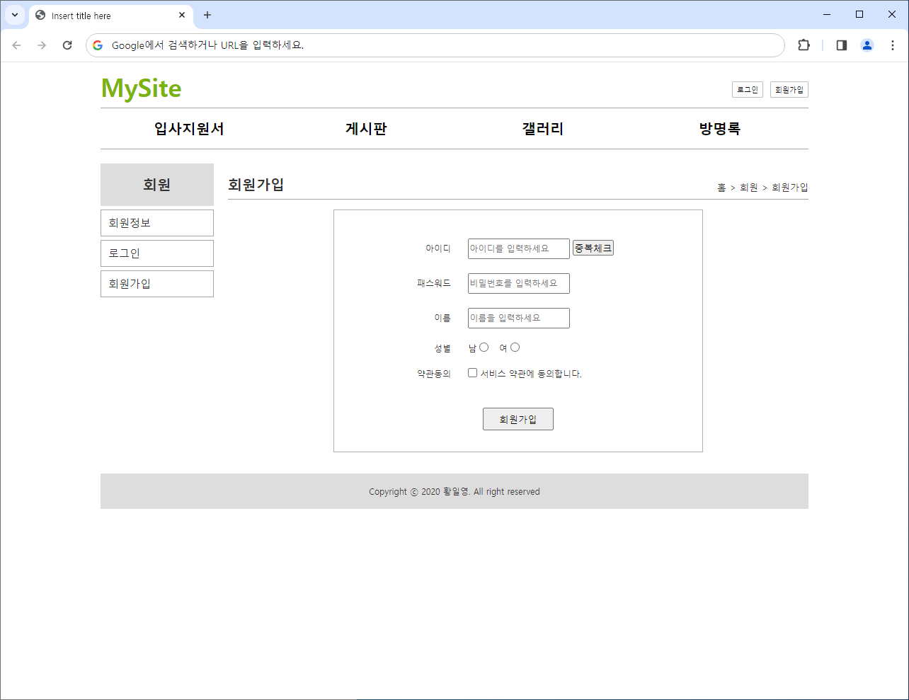
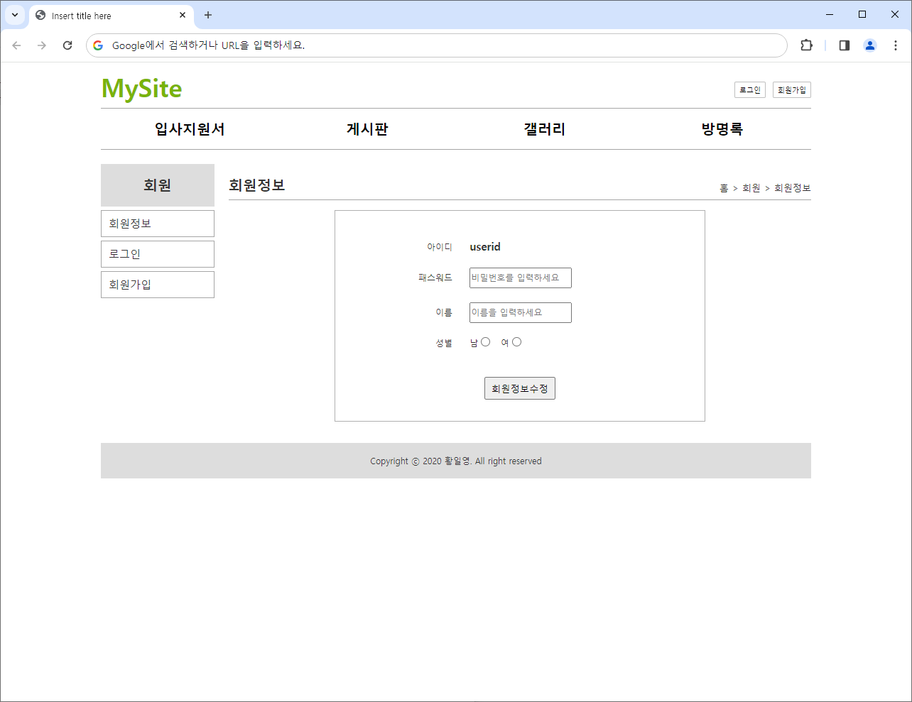
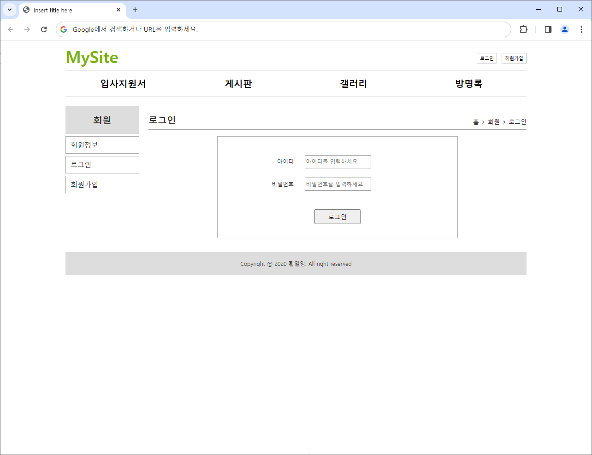
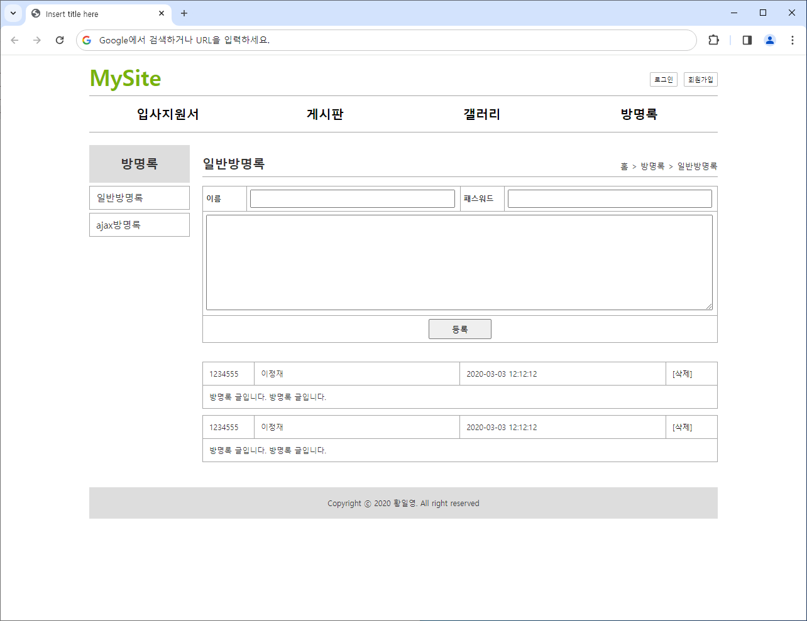
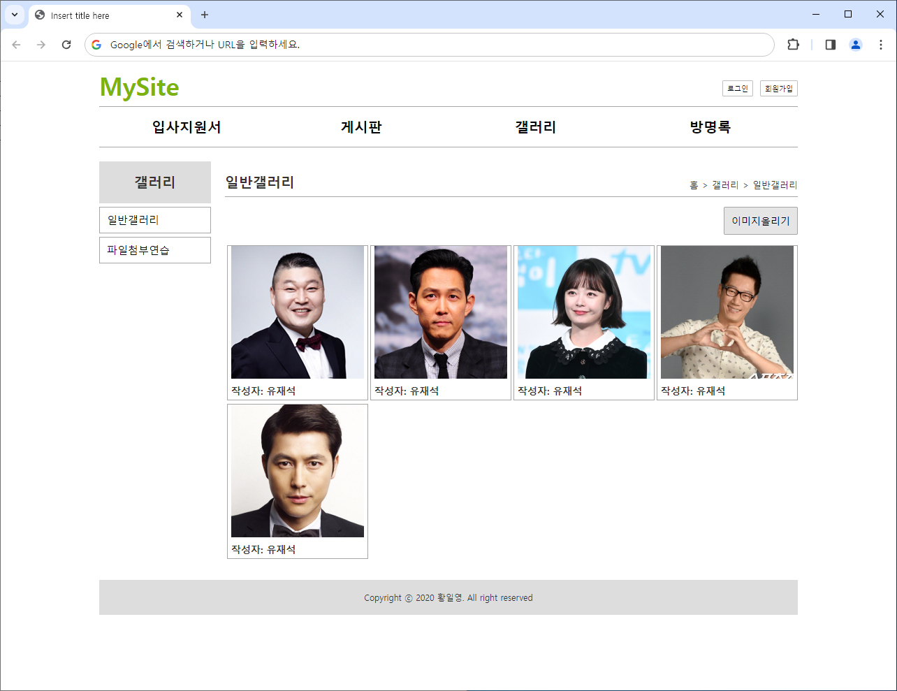
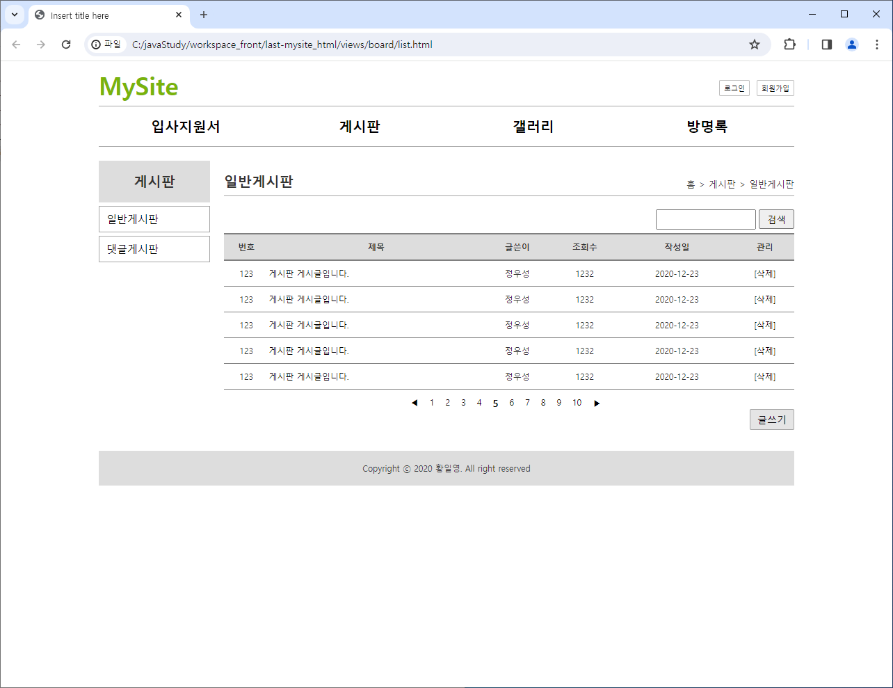
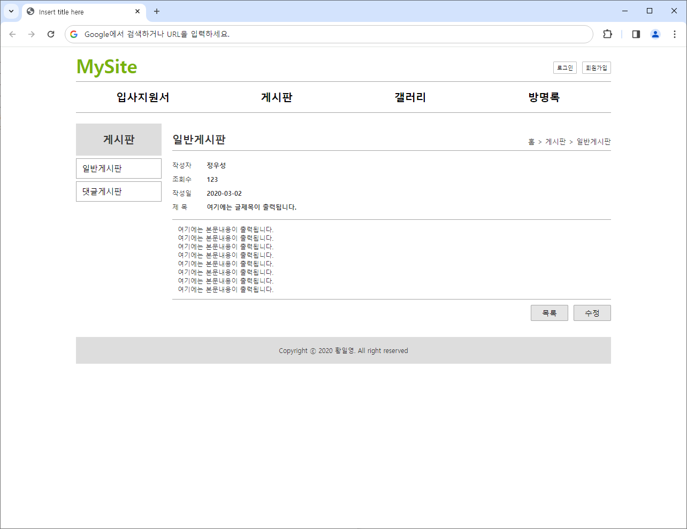
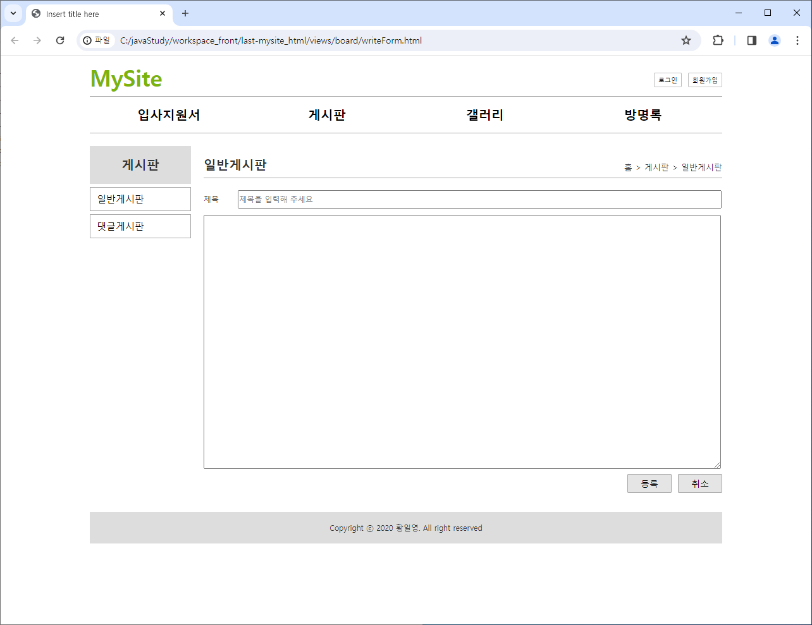
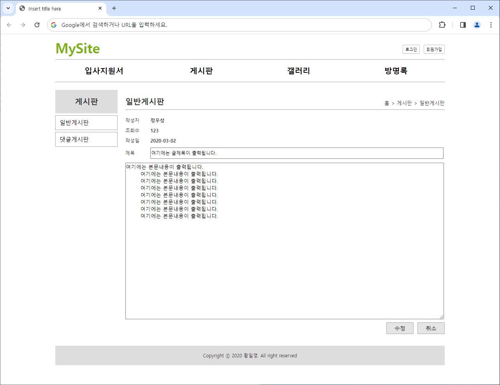

# 과제 Mysite

## 목표
- 새로운 태그 이해하기
    1. `<header>` : 소개 및 탐색에 도움을 주는 콘텐츠
    2. `<nav>` : 현재 페이지 내, 또는 다른 페이지로의 링크
    3. `<main>` : `<body>`의 주요 콘텐츠, 문서의 핵심 주제나 앱의 핵심 기능 직간접 컨텐츠
    4. `<aside>` : 문서의 주요 내용과 간접적으로만 연관된 부분
    5. `<footer>` : 가장 가까운 구획 콘텐츠나 구획 루트
- CSS 중복으로 참조해서 각 코드별로 분리하기
- 폴더별로 HTML 파일 분리하기

## 의문점
초반에 뼈대가 될 HTML 문서를 작성한다고 할 때 `<aside>` 태그를 작성하고 내부의 내용을 안 채워넣을시에 어떻게 동작을 할까?

 ---

 ---

 ---
 
 ---
 
 ---
 
 ---
 
 ---
 
 ---
 
 ---
 
 ---
